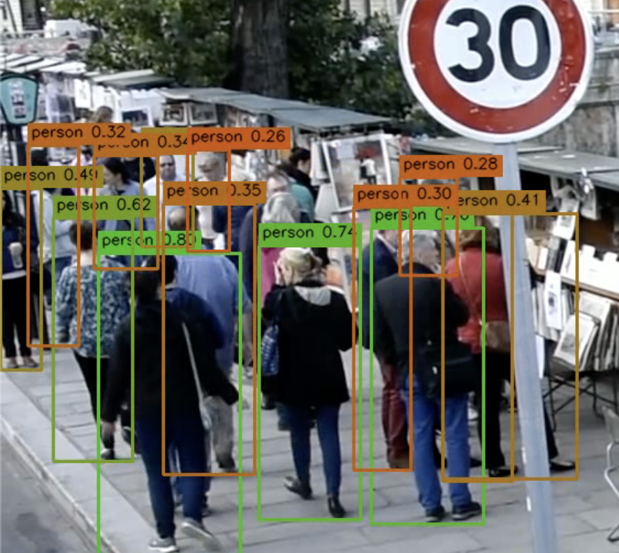
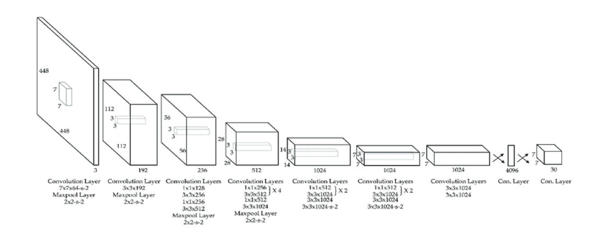
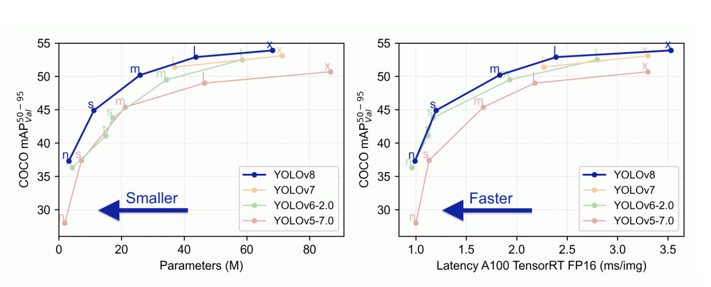
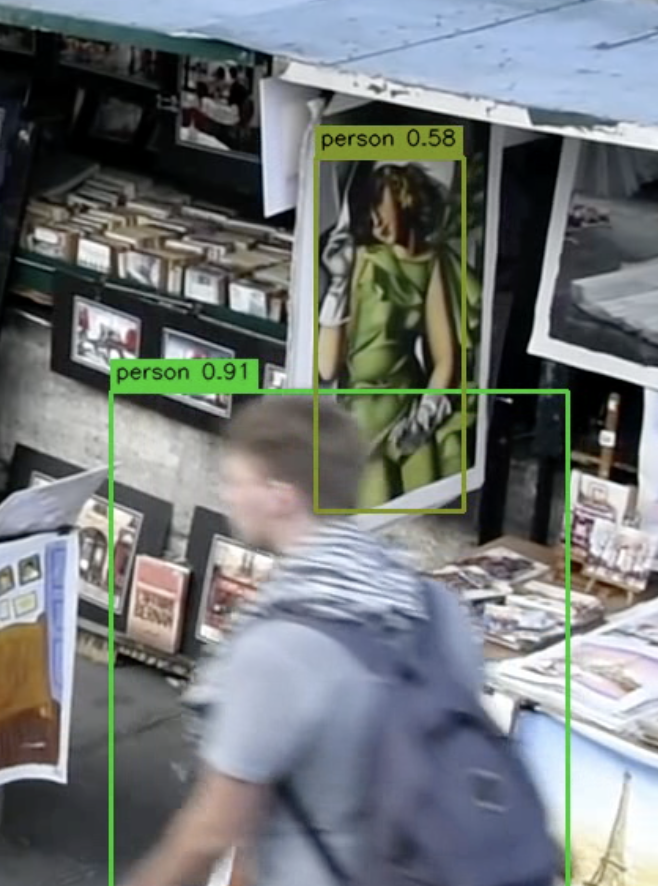
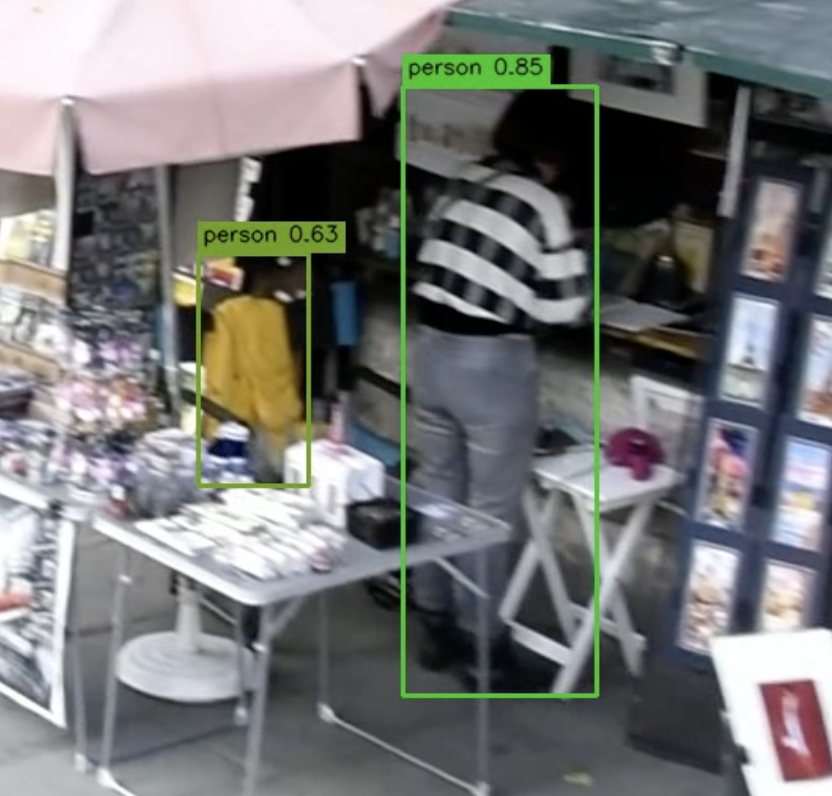

# People Detector (YOLOv8) — детекция людей на видео
Скрипт детектирует людей на видео, отрисовывает рамки и подписи.

> Ниже — короткая GIF-демонстрация результата и пара ключевых кадров.


<p>Пример: плотная толпа</p>


<p>Пример: хорошо детектируется</p>


---

## Структура проекта

```

people-detector/
├─ .venv/                  # виртуальное окружение 
├─ out/
│  └─ crowd_annotated.mp4  # пример выходного видео
├─ assets/                 # изображения и гифка выходного видео
├─ src/
│  ├─ drawing.py           # отрисовка рамок/подписей
│  ├─ infer.py             # загрузка модели и инференс 
│  └─ utils.py             # ввод/вывод видео, сервисные функции
├─ crowd.mp4               # входное видео 
├─ main.py                 # точка входа
├─ requirements.txt        # зависимости
├─ yolov8s.pt              # локальные веса модели YOLOv8
└─ README.md

````
Ниже — короткий блок для README: «что за модель» и почему она выбрана.

---

## Архитектура и выбор модели

**Модель:** Ultralytics **YOLOv8**.



**Почему YOLOv8 для этой задачи:**

* **Скорость + точность**: работает в реальном времени/near-real-time на CPU/GPU при разумном качестве — важно для видео.
* **Класс `person` из COCO**: хорошие предобученные веса без доп. разметки.
* **Гибкость по размеру модели**: `yolov8n` (быстро) ← `yolov8s` (баланс) ← `yolov8m` (выше качество, медленнее). Для  мелких объектов можно перейти с `n` на `s/m`.
* **Практичность**: простой API Ultralytics (`model.predict`), кросс-платформенность (Linux/macOS/Windows), активная экосистема.
* Многоуровневая шейка и decoupled-head устойчивее к частичным окклюзиям; с повышением `imgsz`/`iou` и тайлингом заметно растёт recall по дальним мелким людям.



---

## Возможности

- Предобученная YOLOv8 (Ultralytics) по COCO — класс `person`.
- Тонкие рамки и компактные подписи **над** боксом.
- Настраиваемые параметры из CLI: пороги `--conf/--iou`, частота `--stride`,
  минимальный размер бокса `--min_box`, входной размер `--imgsz`..

---

## Установка

```bash
python -m venv .venv
# Windows: .venv\Scripts\activate
source .venv/bin/activate

pip install -r requirements.txt
````
---

## Запуск

Минимальный запуск (используются значения по умолчанию):

```bash
python main.py
```

Также можно явно указать все ключевые параметры, например:

```bash
python main.py \
  --input crowd.mp4 \
  --output out/crowd_annotated.mp4 \
  --model yolov8s.pt \
  --device auto \
  --conf 0.35 \
  --iou 0.45 \
  --stride 1 \
  --min_box 16 \
  --imgsz 640
```

Посмотреть помощь:

```bash
python main.py --help
```

---

## Параметры CLI 

* `--input` — путь к входному видео (по умолчанию `crowd.mp4`).
* `--output` — путь к выходному видео MP4 (по умолчанию `out/crowd_annotated.mp4`).
* `--model` — веса YOLO (`yolov8n.pt`, `yolov8s.pt`, локальный `*.pt`).
* `--device` — `auto` / `cuda` / `cpu`. `auto` сам выберет устройство.
* `--conf` — порог уверенности [0..1]. Ниже — отброс (больше → чище, меньше → больше находок).
* `--iou` — порог IoU для NMS [0..1]. Выше — меньше слияния соседних боксов.
* `--stride` — детектировать каждый N-й кадр (ускорение на CPU).
* `--min_box` — отбрасывать слишком маленькие боксы (минимальная сторона, px).
* `--imgsz` — входной размер для инференса (px). 640/832/960/1280…
  Больше — лучше для мелких объектов, но медленнее.

---

## Результат

На выходе — видео с рамками класса **person** и подписью `person {score}`, цвет рамки меняется
плавным градиентом **по уверенности** (красный → зелёный).
Выходной FPS и размер совпадают с входными.

---

## Проблемные случаи 

Ниже — кадры, где модель срабатывает хуже. Эти примеры использованы для подбора параметров и планов улучшений.

1. **Ложные срабатывания**   
   <br>
   <p> Картина принимается за человека:</p>
   
   <p> Куртка на стуле принимается за человека:</p>
   

2. **Мелкие люди на заднем плане**  
   <p> Далёкие, быстро движущиеся люди не детектируются или “слипаются” из-за NMS.</p>
   <br>
   

**Мои эмпрические наблюдения:**
- Увеличиваю `--imgsz` (1280), чтобы кадры перед инференсом масштабировались до указанного размера (чем больше размер, чем лучше видно мелкие объекты).
- Понижаю порог уверенности `--conf` (0.25), поскольку это дает больше слабых детекций (люди на заднем плане, люди за людьми и тд).
- Поднимаю `--iou` (0.55), поскольку, если рядом много людей, слишком низкий --iou может “сливать” соседние боксы.
- Снижаю `--min_box` (1), чтобы боксы с минимальной шириной или высотой меньше заданного порога не отбрасывались перед отрисовкой (на заднем фоне много "мелких" людей).
